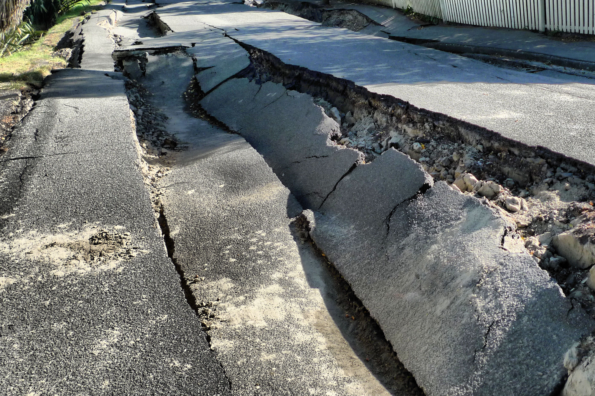

<!---
layout              : page-fullwidth
show_meta           : false
title               : "Events"
subheadline         : "FIND"
teaser              : "Search for events with legacy data."
header:
#   image_fullwidth  : "world2.jpg"
   image_fullwidth  : "crack_resize.jpg"
permalink           : "/events/"



--->

<p style="text-align: center;">
<br>
<iframe src="../_static/events_orig.html"  width="1000px" height="666px"></iframe>

</p>
<hr>


# Events 
## Description

Events shown have been associated with the availability of legacy seismic data that has been converted to digital images or in same cases digital time series. Data maybe downloaded or available upon request.

See the corresponding [organization](../find_data/organizations/index.md) for more information.

See [monitoring](../find_data//index.md) for events related to nuclear testing.


### Layer Key
[**SCSN:**](../find_data/organizations/SCSN) M> 3.5 earthquakes recorded by the Southern California Seismographic Network between 1963-1992.
<br>
[**Seismo Archives:**](https://ds.iris.edu/seismo-archives/quakes/) Earthquakes as part of the International Digital Earthquake Archives.
<br>
[**WWSSN:**](../find_data/organizations/wwssn) M&ge;6 earthquakes recorded by the Worldwide Standardized Seismographic Network.
<br>


<hr>

### Individual Events
```{toctree}
---
maxdepth: 1
---
pinatubo.md
```


### EuroSeismos
Not mapped above is the [Earthquake Catalogue](http://storing.ingv.it/es_web/Data/Es_map.html) from the EuroSeismos project with a list of 629 earthquakes from the Euro-Mediterranean region from 1895-1990.


