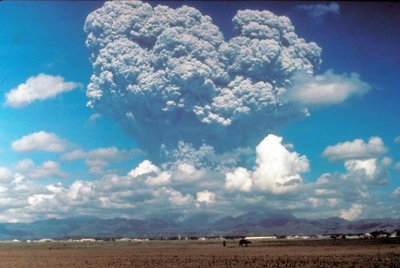

# 1991 Eruption of Mount Pinatubo, Philippines

Data set consists of scanned seismic drum records recorded at Mount Pinatubo between April 30 and June 17, 1991. The archive contains 145 drum records that recorded seismicity associated with the 1991 eruptions. These drum records are the only continuous seismic records produced from a local network of seismic stations. The images of the drum records are in PDF format.

## Stations

| **Location** | **Code** | **Latitude** | **Longitude** | **Timespan** | **Components**
| :--- | :--- | :---: | :---: | :---: | :---: |
|  - |  PIE  | 15.18  | 	120.43 | April 30 - June 15, 1991 |  vertical 
|  - |  UBO  | 15.14  | 	120.36 | May 1 - June 11, 1991 |  vertical 
|  - |  CAB  | 15.18  | 	120.36 | June 12 - June 17, 1991 |  3 component 

## Instrumentation
PIE, UBO:  vertical component Mark Products L-1 seismometers with a natural frequency of 1 Hz.  
CAB: Mark Products L-22 three component seismometer with a natural frequency of 2 Hz.

## Recording Medium
Kinemetrics PS2 portable drum recorder using an ink pen.

## Data Availability

Records can be dowloaded through the USGS ScienceBase-Catalog: 
* [https://www.sciencebase.gov/catalog/item/67f7cf83d4be024f83a3962e](https://www.sciencebase.gov/catalog/item/67f7cf83d4be024f83a3962e)

**no. available** | **format** | **dpi** | **color**|
| :---: | :---: | :---: | :---:|
145 | pdf |  |

Copies of the original records are stored at the Philippine Institute of Volcanology and Seismology (PHIVOLCS) office in Quezon City and the USGS Cascades Volcano Observatory in Vancouver, Washington.

## Contact
For more information about this collection, please contact: \< *blank* \>

## References

Lockhart, A.B., Marcial, S. Ambubuyog G., Laguerta, E., Power, J., 1996, Installation, operation, and technical specifications of the first Mount Pinatubo telemetered seismic network, in Newhall, C. G., Punongbayan, R.S., (eds), Fire and Mud, Eruptions and Lahars of Mount Pinatubo, Philippines, University of Washington Press, p. 215 – 224.

## Additional References

Lockhart, A.B., Marcial, S. Ambubuyog G., Laguerta, E., Power, J., 1996, Installation, operation, and technical specifications of the first Mount Pinatubo telemetered seismic network, in Newhall, C. G., Punongbayan, R.S., (eds), Fire and Mud, Eruptions and Lahars of Mount Pinatubo, Philippines, University of Washington Press, p. 215 – 224.

Murray, T.L., Power, J.A., Davidson, G., Marso, J.N., 1996, A PC-based real-time volcano-monitoring data-acquisition and analysis system, in Newhall, C. G., Punongbayan, R.S., (eds), Fire and Mud, Eruptions and Lahars of Mount Pinatubo, Philippines, University of Washington Press, p. 225 – 247.

Endo, E.T., Murray, T.L., Power, J.A., 1996, A comparison of preeruptin Real-Time Seismic Amplitude Measurements for Eruptions at Mount St. Helens, Redoubt Volcano, Mount Spurr, and Mount Pinatubo, in Newhall, C. G., Punongbayan, R.S., (eds), Fire and Mud, Eruptions and Lahars of Mount Pinatubo, Philippines, University of Washington Press, p. 233 – 267.

Cornelius, R.R., Voight, B., 1996, Real-time seismic amplitude measurement (RSAM) and seismic spectral amplitude measurement (SSAM) analyses with materials failure forecast method (FFM), June 1991 explosive eruption of Mount Pinatubo, in Newhall, C. G., Punongbayan, R.S., (eds), Fire and Mud, Eruptions and Lahars of Mount Pinatubo, Philippines, University of Washington Press, p. 249 – 267.

Power, J.A., Murray, T.L., Marso, J.N., Laguerta, E.P., 1996, Preliminary observations of seismicity at Mount Pinatubo by use of the seismic spectral amplitude measurement system (SSAM) system, May 13 – June 18, 1991, in Newhall, C. G., Punongbayan, R.S., (eds), Fire and Mud, Eruptions and Lahars of Mount Pinatubo, Philippines, University of Washington Press, p. 269 – 283.

Harlow, D.H., Power, J.A., Laguerta, E.P., Ambubuyog, G., While, R.A., Hoblitt, R.P., 1996, Precursory seismicity and forecasting of the June 15, 1991, eruption of Mount Pinatubo, in Newhall, C. G., Punongbayan, R.S., (eds), Fire and Mud, Eruptions and Lahars of Mount Pinatubo, Philippines, University of Washington Press, p. 285 – 305.

White, R.A., 1996, Precursory deep long-period earthquakes at Mount Pinatubo: spatio-temporal link to a basalt trigger, in Newhall, C. G., Punongbayan, R.S., (eds), Fire and Mud, Eruptions and Lahars of Mount Pinatubo, Philippines, University of Washington Press, p. 307 – 327.

Bautista, B.C., Bautista, M.L.P., Stein, R.S., Barcelona, E.S., Punongbayan, R.S., Laguerta, E.P., Rasdas, A.R., Ambubuyog, G., Amin, E.Q., 1996, Relationship of regional and local structures to Mount Pinatubo activity, in Newhall, C. G., Punongbayan, R.S., (eds), Fire and Mud, Eruptions and Lahars of Mount Pinatubo, Philippines, University of Washington Press, p. 351 – 370.

Mori, J., Eberhart-Phillips, Harlow, D.H., 1996, Three-dimensional velocity structure at Mount Pinatubo: resolving magma bodies and earthquake hypocenters, in Newhall, C. G., Punongbayan, R.S., (eds), Fire and Mud, Eruptions and Lahars of Mount Pinatubo, Philippines, University of Washington Press, p. 371 – 385.

