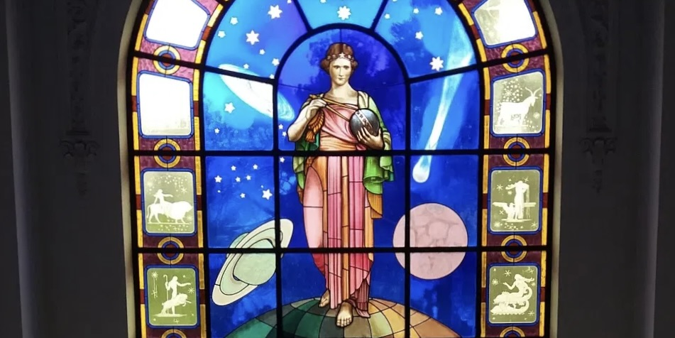

<!--
layout              : page
show_meta           : false
title               :  Institut Cartogràfic i Geològic de Catalunya
subheadline         : "ICGC"
teaser              : "More information about this network"
header:
   image_fullwidth  : "spain.jpg"
permalink           : "/organizations/icgc"
breadcrumb          : true
--->

# Institute of Astronomy, Geophysics & Atmospheric Science, Univ. of Sao Paulo 
The Institute of Astronomy, Geophysics and Atmospheric Sciences of the University of São Paulo ([IAG/USP](https://www.sismo.iag.usp.br/)) operated several seismographic stations between 1975 and 2000, which were usually associated with dam monitoring. 

Seismographic stations operated by IAG/USP that have used paper records since 1976 and magnetic observatories operated by the National Observatory since 1915 will be available once the collection is completely scanned.

## Stations

**Location** | **Code** | **Latitude** | **Longitude** | **Timespan** | **Components**
| :--- | :---: | :---: | :---: | :---: | :---:
Sobradinho Sovela        | SOB|-9.2888|-41.1694 | | 
Sobradinho Serra       | SOB1    | -9.2088| -40.8948   |1978-1997| 
Sobradinho São Gonçalo | SOB2    | 	-9.5685| -40.9612  |         | 
Sobradinho Tapuio      | SOB3    | -9.7708| -41.2638   |         | 
Sobradinho Grosado    | SOB4    | -9.3425| -41.4842   |         | 
Valinhos              | VAO| -23.0267|  -46.9662   | | 
Natal             |  NAT    | -5.101|  -35.0303   | | 
Barra Mansa           |  BMA   | -22.695| -44.1537     | | 
Brasópolis            | BRAS    | -22.5339| 45.5842     | | 
Foz da Areia           | FDA    |-25.9869| 	-51.5067 | | 
Foz da Areia II        | FDA1 |-25.9917 | -51.6333 | | 
Foz da Areia III        | FDA2 |-25.8602| -51.4385 | | 
Foz da Areia IV        | FDA3 |-25.89782 | -51.6332 | | 
Foz da Areia V        | FDA4 |-26.1675 | -51.7705 | | 
Foz da Areia VI        | FDA5 |-26.1498 | -51.4552 | | 
Itatiaia              | ITA |-22.3755 | -44.7017 | | 
Itaparica             | ITR |-8.7613 |-38.4233 | 1982-2005| 
Itaparica I           | ITR2 |	-9.097 |-38.2548 | | 
Itaparica II           | ITR3 |	-9.174 |-38.4008| | 
Itaparica III          | ITR5 |	-8.9998 |-38.4595| | 
Pedra do Cavalo          | RSPC |-12.5314 |-39.1225 | | 
Pedra do Cavalo I        | RSP1 |-12.6036|-39.0609 | | 
Pedra do Cavalo II       | RSP3 |-12.5284|-39.0066 | | 
Rio de Janeiro           | RDJ |-22.895|-43.2233 | | 
Xingó                    | XIN |	-9.4481 |-37.8365| | 

## Instrumentation
Teledyne Geotech model S/13
Wilmore MK IIIA 

Response curves are available.

## Recording Medium
pen on paper

## Data Availability

Project in progress.

Station and date ranges available as indicated in above table.  *Last accessed 2025 November 13.*

**no. available** | **format** | **dpi** | **color**
| :---: | :---: | :---: | :---:
 11,031| jpog| 600 | RGB
 11,031 | tiff| 1200 | RGB

More information about the archive can be found on the Historical Geophysical Data Archive [website](https://www.dadosraros.iag.usp.br/acervo/#).

[Download data](https://www.dadosraros.iag.usp.br/acervo/search/sismogramas.php)
## Contact
For more information about this collection, please contact: 
## References

Nascimento, EP Peixoto, IMC Oliveira, RR Lima, ALM Franco, DR Hartmann, GA Bianchi, M. Hannesch, O. Garcia, ACO Santos, AGF Rangel, MF Abdulmalek, A. Aguiar, HH Costa, VA Aguiar, LF Santos, ES Frade, EP Wiermann, A. Guimaraes, LM Ladeira, HF Bernardes, VS Papa, ARR Trindade, RIF Vieira, FP Pinheiro, JK, et al.; Conservation and Digitization of the Historical Geomagnetic Record of the Vassouras Magnetic Observatory . In: 16th International Congress of the Brazilian Geophysical Society, 2019, Rio de Janeiro. 16th International Congress of the Brazilian Geophysical Society - Official Program, 2019.

Franco, DR; Hartmann, GA; Bianchi, M.; Hannesch, O.; Garcia, ACO; Santos, AGF; Rangel, MF; Abdulmalek, A.; Peixoto, BMI; Aguiar, LF; Santos, ES; Frade, EP; Wiermann, A.; Guimaraes, L.M.; Ladeira, HF; Bernardes, VS; Papa, ARR; Trindade, RIF; Yokoyama, E.; Barbosa, JR. Conservation, scanning and digitization of historical geomagnetic data archives from Brazil . In: II Pan American Workshop on Geomagnetism, 2017, Vassouras. II PANGEO - Program and Abstracts, 2017.

Bianchi, M.; Franco, DR; Hartmann, GA; Hannesch, O.; Garcia, ACO; Santos, AGF; Barbosa, J.; Trindade, RIF; Papa, ARR; Rangel, MF; Koki, P.; Moreira, C.; Cardoso, V.; Abdulmalek, A.; Bernardes, VS. Building a Geophysical Historical Data Archive in Brazil . In: 26th International Union of Geodesy and Geophysics (IUGG) General Assembly, 2015, Prague. 26th International Union of Geodesy and Geophysics (IUGG) General Assembly, 2015.

**Photo Credits:**
[Joalpe](https://commons.wikimedia.org/wiki/File:Parque_Cientec_da_USP_-_76.jpg), CC BY-SA 4.0, via Wikimedia Common