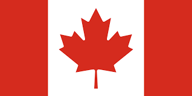

<!---
layout              : page
show_meta           : false
title               : "Canadian National Seismograph Network"
subheadline         : "CNSN"
teaser              : "More information about this network"
header:
   image_fullwidth  : "organizations_resampled.jpg"
permalink           : "/organizations/cnsn"
breadcrumb          : true
--->

# Canadian National Seismograph Network
The first continuously recording photographic seismograph station in North
America began operation in September 1897 in Toronto (TNT). By 1939, 11 stations were in operation across Canada.
 All but Ottawa (OTT) and Halifax (HAL) are now closed. See Stevens (1990) for more information on the history of some stations in Canada.

The modern network is operated by Natural Resources Canada.

[Natural Resources Canada](https://earthquakescanada.nrcan.gc.ca)

## Stations
A single set (rarely more) of LP and SP scans are available for the stations below.

**Region** | **Location** | **Code** | **Latitude** | **Longitude** | **Timespan** | **Components**
| :--- | :--- | :---: | :---: | :---: | :---: | :---:
Canada|ALE |  Alert |   | 	  |  |  6
| EDM | Edmonton|   | 	  |   | 6
| FBC| Frobisher Bay |   | 	  | |  6
| FFC| Flin Flon|   | 	  |   | 6
| FSB| Fort St. James|   | 	    ||  6
| GWC| Great Whale River|   | 	  |  |  6
| HAL| Halifax|   | 	  |  |  6
| LDN| London|   | 	  |  |  6
| MBC| Mould Bay|   | 	|    |  6
| MNT| Montreal|   | 	 |   |  6
| MUM| Musselwhite Mine|   | 	|    |  6
| OTT| Ottawa|   | 	  |  |  6
| PHC| Port Hardy|   | 	  |  |  6
| PNT| Penticton|   | 	  |  |  6
| RES|Resolute|   | 	|    |  6
| SCB| Scarborough|   | 	  |  |  6
| SCH| Schefferville|    	|  |  |  6
| SES| Suffield|   | 	 |   |  6
| SFA| St. Ferreol les Neiges|   |	|   |  6
| SJNN| St Johns|   | 	|   |  6
| YKA|Yellowknife|   | 	|    |  6

## Instrumentation

## Recording Medium

## Data Availability
35 mm films of seismograms of the CNSN for 1962-1986 were initially sent to the National Earthquake Center in Golden, Colorado. The films are now part of the collection stored at the Albuquerque Seismological Laboratory. Some of these stations were included in the efforts to scan WWSSN records (see [WWSSN](../organizations/wwssn)). Scans will be made available through IRIS DMC.

The Earthquake Research Institute maintains ~1800 rolls of 35 mm films from 23 stations of the Canadian seismograph network between 1982-1989. Some event log sheets are also available (Satake et al., 2020).

Paper records have been maintained for this collection.

## Contact
For more information about this collection, please contact: \< *blank* \>

## References
Satake, K.,
H. Tsuruoka, S. Murotani, and K. Tsumura
(2020). Analog Seismogram Archives at
the Earthquake Research Institute, the
University of Tokyo, Seismol. Res. Lett. 91,
1384–1393, doi: 10.1785/0220190281.

Stevens, Anne E. (1980) History of some Canadian and adjacent American seismograph stations. *Bulletin of the Seismological Society of America* 70 (4): 1381–1393. doi: https://doi.org/10.1785/BSSA0700041381
