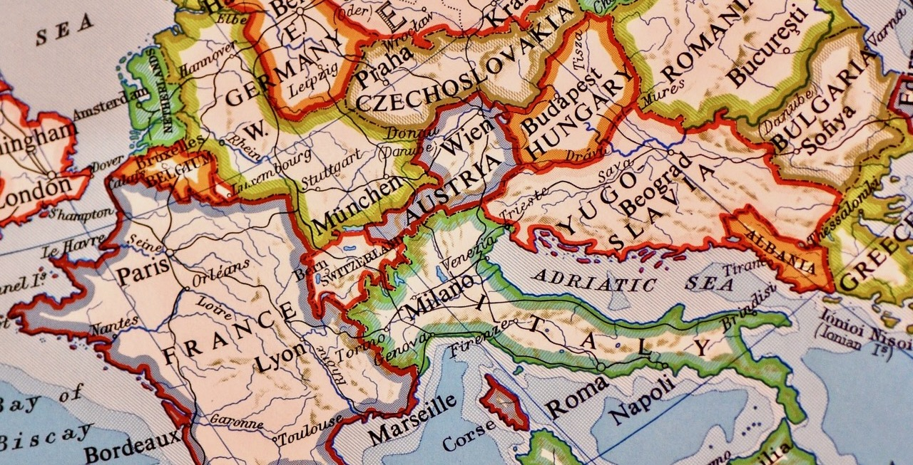

<!---
layout              : page
show_meta           : false
title               : "EuroSeismos"
subheadline         : "Europe"
teaser              : "More information about this project"
header:
   image_fullwidth  : "euroseismos.jpg"
permalink           : "/organizations/euroseismos"
breadcrumb          : true
--->

# EuroSeismos

The EuroSeismos project's main objectives are to enable the reuse of historical seismograms for reanalyses of historical Euro-Mediterranean earthquakes using modern analysis. In fostering the preservation of seismic records in the Euro-Mediterranean region, the project leverages the expertise of the SISMOS project of Istituto Nazionale di Geofisica e Vulcanologia (INGV) in expanding the availability of high quality, digital data online.

Currently 33 researchers from 29 countries are participating in the project.

## Stations
300 seismic stations mostly in the Euro-Mediterranean region from 1895-1990. See also the station [list](http://storing.ingv.it/es_web/).
[Partner countries:](http://storing.ingv.it/es_web/)

| |  |  |  |
| :---: | :---: | :---: | :---: |
| Albania  | Finland | Malta | Spain  |
| Algeria | France | Morocco | Sweden  |
| Belgium | Georgia | Netherlands | Switzerland  |
| Croatia | Germany | Norway | Turkey  |  
| Czech Republic | Israel | Portugal |  |
| Denmark | Italy | Romania |  |
| Egypt | Republic of Macedonia | Slovenia |  |

## Instrumentation

## Recording Medium

## Data Availability

Approximately 25,000 historical seismograms are available from a list of 629 earthquakes from 1895-1990. [[map](http://storing.ingv.it/es_web/Data/Es_map.html)]. Another 152,000 are available through the SISMOS project.

**no. available** | **format** | **dpi** | **color**|  |
 :---: | :---: | :---: | :---: | :---: 
 152,000 | XX | 600  | grayscale | Italian Observatories 
   25,000| XX | 600 | grayscale | Euro-Mediterranean stations

Low resolution images (200 dpi) can be viewed online.

Higher resolution images can be requested through the [Seismogram Request 2.0](http://seismogramrequest.rm.ingv.it/) system. Registration is required.

Seismograms are distributed under the [Creative Commons Attribution 4.0 International License](http://creativecommons.org/licenses/by/4.0/). Use may be restricted depending on the seismic station.

Some station [bulletins](http://storing.ingv.it/es_web/) are also available.

More information about the EuroSeismos project is available through their [website](http://storing.ingv.it/es_web/).

INGV has long promoted the historical and cultural heritage of Italian seismology. The TROMOS and SISMOS projects were instrumental in promoting and developing methods for the conservation and preservation in digital formats of this scientific heritage. In addition to scanned seismogram images, INGV has available by request:
 * digital images of historical seismic bulletins
 * digital data of selected seismograms
 * complementary documentation

INGV has also developed [Teseo2](http://teseo.rm.ingv.it/) to vectorize seismograms. [[github](https://github.com/INGV/teseo2)]

More information about the TROMOS and SISMOS project is available through their [website](http://sismos.rm.ingv.it/index.php).

## Contact
For more information about this collection, please contact:

## References
Ferrari, G. ,Pino, N. A. (2003). EUROSEISMOS 2002-2003 a project for saving and studying historical seismograms in the Euro-mediterranean area, EGS - AGU - EUG Joint Assembly, https://ui.adsabs.harvard.edu/abs/2003EAEJA.....5274F

Okal, E. A. (2015). Historical seismograms: Preserving an endangered species. GeoResJ, 6, 53–64. doi: 10.1016/j.grj.2015.01.007

Pintore, S., Quintiliani, M. Franceschi, D. (2005). Teseo: A vectoriser of historical seismograms, Computers & Geosciences 31, p. 1277–1285.

Saving and Studying the Seismograms of the Strongest Euro-Mediterranean Earthquakes, http://storing.ingv.it/es_web/. *Last accessed 8 February 2022*.

SISMOS, http://sismos.rm.ingv.it/index.php. *Last accessed 9 February 2022*.
