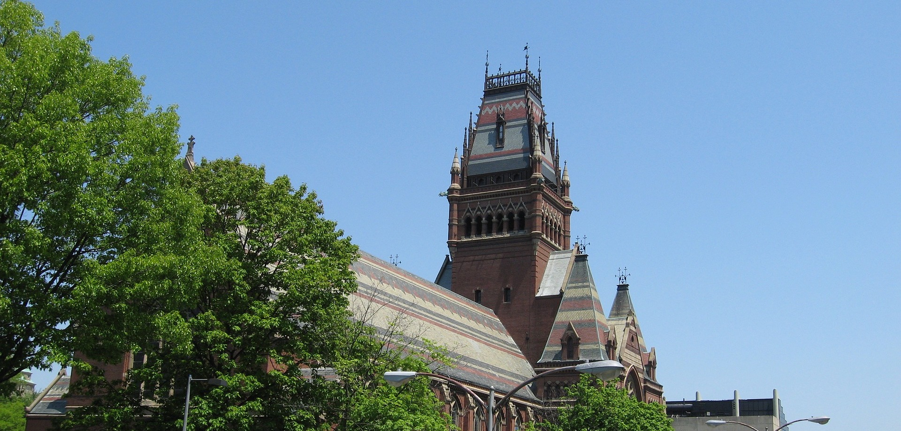

<!---
layout              : page
show_meta           : false
title               : "Harvard - Adam Dziewonski Observatory"
subheadline         : "HRV"
teaser              : "More information about this station"
header:
   image_fullwidth  : "harvard.jpg"
permalink           : "/stations/harvard"
breadcrumb          : true
--->

# Harvard
Owned and maintained by Harvard University, the Harvard seismograph station  at Oak Ridge Observatory was developed in 1933 under the direction of Prof. L. Don Leet. The station operated through 1952 and recorded intermittently to paper during the 1960s, and between 1989 to 1997. Today, the station is part of the Global Seismic Network ([HRV](https://earthquake.usgs.gov/monitoring/operations/stations/IU/HRV/)). In 2009, the station was renamed in honor of Prof. Adam Dziewonski.

The station is currently operated by the [Albuquerque Seismological Laboratory](https://ohiodnr.gov/wps/portal/gov/odnr/discover-and-learn/safety-conservation/about-ODNR/geologic-survey).

## Stations

| **Location** | **Code** | **Latitude** | **Longitude** | **Timespan** | **Components**
| :--- | :--- | :---: | :---: | :---: | :---: |
| Oak Ridge, Massachusetts |  HRV | 42.5072 | -71.5625  | 1933-1997 | 6  |

## Instrumentation
Benioff Vertical Seismogram; Galvanometer 1; Tg=0.2, 0.3; To=1  
Benioff Vertical Seismogram; Galvanometer 2; Tg=13, 13.5, 14; To=1 
Wood-Anderson Horizontal Torsion Seismograph No.1; EW 
Wood-Anderson Horizontal Torsion Seismograph No.2; NS 
Milne-Shaw Horizontal Pendulum Seismograph No.43; NW-SE; To=12sec; v=25degrees 
Milne-Shaw Horizontal Pendulum Seismograph No.44; NE-SW; To=12sec; v=25degrees 

## Recording Medium
photographic paper  36 inches x 14 inches

## Data Availability

Of the 16,000 surviving analogue seismograms, 15% were damaged beyond recovery. 
Paper records from 1989-1997 no longer exist.

**no. available** | **years**|**format** | **dpi** - front(back)| **color** - front(back)
| :---: || :---: | :---: | :---: | :---:
~10,200 |1933-1953| tif, jpg | 1200(400)   | color(grey scale)

Seismograms can be downloaded from the Harvard Seismology [website.](http://www.seismology.harvard.edu/HRV/1933.html#0828)

Some seismograms are available in SAC format. Vectorization is ongoing.

Harvard University develops and maintains the opensource code [DigitSeis](http://www.seismology.harvard.edu/research/DigitSeis.html) for vectorization of seismograms.

For more information on preservation efforts, see Ishii *et al.* (2015) and the [HRV Seismogram Archival Project](http://www.seismology.harvard.edu/HRV/archive.html)

## Contact
For more information about this collection, please contact: [Thomas Lee](mailto:talee@fas.harvard.edu)

## References
Harvard Seismology. http://www.seismology.harvard.edu/HRV/status.html *Last accessed 20 January 2022*

Ishii, M., H. Ishii, B. Bernier, & E. Bulat (2015). Efforts to recover and digitize analog seismograms from Harvard-
Adam Dziewonski observatory. Seismol. Res. Lett., 86(1):255-261.

Lee, T. A., M. Ishii, H. Ishii & T. Morinaga (2019). The Potential of Analog Seismograms for Science and Education,
presented at 2019 Legacy Securing Legacy Seismic Data to Enable Future Discoveries Workshop, Albuquerque,
New Mexico, Sept 18-19, 2019.
 
 

**Photo Credit:** Hornandsoccer, [CC BY-SA 2.5]( https://creativecommons.org/licenses/by-sa/2.5), via Wikimedia Commons
