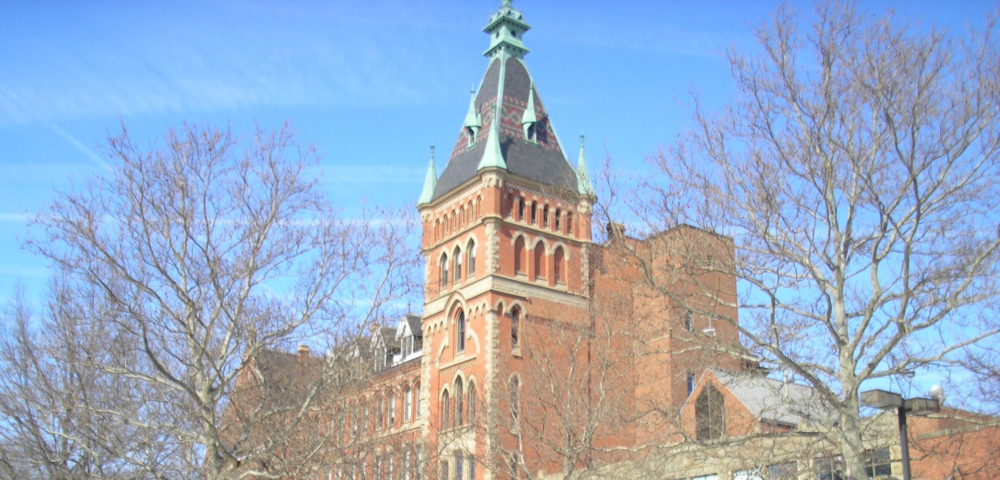

<!---
layout              : page
show_meta           : false
title               : "John Carroll University"
subheadline         : "JCU"
teaser              : "More information about this station"
header:
   image_fullwidth  : "ohio.jpg"
permalink           : "/stations/ohio"
breadcrumb          : true
--->

# John Carroll University JCU
The first Jesuit seismic observatory was established at John Carroll University in Cleveland, Ohio by Father Frederik L. Odenbach in 1900.  He went on to create a seismic network that spanned across the United States and Canada at different Jesuit institutions. The observatory was closed in 1992 and the records were put into storage at the H.R. Collins Laboratory & Core Repository in 2000. In 1999, the Ohio Seismic Network (Ohio Geological Survey) assumed responsibility for these records.

Currently maintained by the [Ohio Geological Survey](https://ohiodnr.gov/wps/portal/gov/odnr/discover-and-learn/safety-conservation/about-ODNR/geologic-survey).

## Stations

| **Location** | **Code** | **Latitude** | **Longitude** | **Timespan** | **Components**|
| :--- | :--- | :---: | :---: | :---: | :---: | 
| Cleveland, Ohio |  JCU | 41.4856 | -81.7056  | |  3 
| | |  41.1911 | -81.5312 | 1946-1968|
| | | 41.4888 | -81.5321 | 1968-?|

Station was relocated after 1931.

## Instrumentation
1909-1947 Wiechert 80kg horizontal  
1947-1986 Sprengnether LP horizontal, SP vertical  

## Recording Medium
smoked paper  
paper

## Data Availability
Digital scanning has not begun.

The entire analog collection, >100,000 seismograms, is available to interested researchers. The records are continuous from the early 1920's through 1931.

A small subset of global earthquakes are available upon request. These 64 records are 50-100MB tif files. See also [special collection](https://o90014.eos-intl.net/O90014/OPAC/Details/Record.aspx?BibCode=3130132).

The John Carroll University Archives include the James B. Maelwane Manuscript Collection. Scholarly works may include notebooks, earthquake bulletins and traveltime tables from the 1930's. [more info](https://sluarchives.libraryhost.com/repositories/2/resources/51/collection_organization)

## Contact
For more information about this collection, please contact:
 * [Jeff Fox](mailto:Jeffrey.fox@dnr.ohio.gov), OhioSeis Seismologist
 * [Lisa Long](mailto:Lisa.long@dnr.ohio.gov), Library Administrator

## References
Birkenhauser, H.F. Chapter IX John Carroll University Observatory Cleveland, Ohio. http://www.eas.slu.edu/eqc/eqc_history/JSA25/JSA_chpt09.pdf

Fox, J. (2019). Preserving Ohio’s Historic Seismogram Collection: 83 Years of Global Seismology: 1909 – 1992
presented at the 2019 Seismological Society of America Annual Meeting, April 23-26, 2019 Seattle, WA.

Hansen, M.C. (2000). OhioSeis - The Ohio Seismic Network, Ohio Geology, 1.

**Photo Credit:** Hornandsoccer, [CC BY-SA 2.5]( https://creativecommons.org/licenses/by-sa/2.5), via Wikimedia Commons
