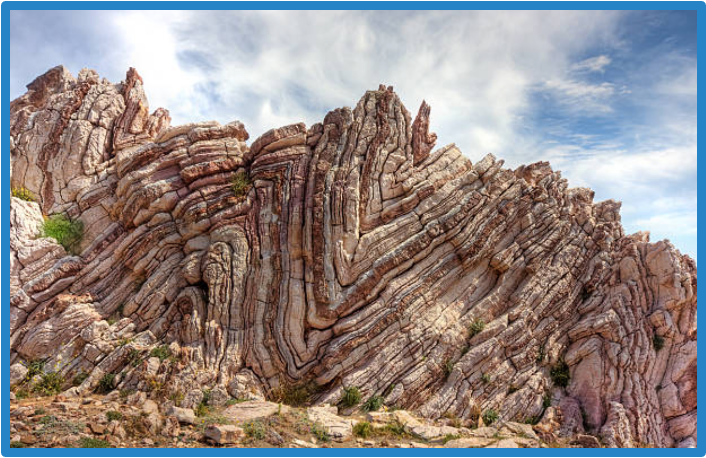

<!---
layout              : page
show_meta           : false
title               : "Web Resources"
subheadline         : "websites of interests"
teaser              : "Additional resources for historical seismic data"
header:
   image_fullwidth  : "seismogram.jpg"
permalink           : "/resources/webresources/"
--->

# FOLDS - Federation of Online Legacay Data in Seismology

## Background
Proposed metadata fields for standardizing metadata needed to support an internationally coordinated
collection system of digital legacy seismic data elements generated from analog
recordings. These standards
will make easier the work of those at collection centers creating the metadata and
at data centers that manage metadata and corresponding legacy data. However, to
manage the level of effort required for data collection centers to participate,
enough metadata is required to make legacy data Findable, Accessible,
Interoperable and Reusable (FAIR).

## Specification
Below is the recommended specifications by the WG2 of the FDSN (2022) proposed by Tim Ahern et al.

See also [[pdf](https://www.fdsn.org/media/wg/II/2023/WG2-2023-LegacyData-Ahern.pdf)].

**Metadata** | **Element (56)** | **Description** | **Req** | **Rec** | **Opt** |
:--- | :--- | :--- | :---: | :---: | :---: | 
Time of Data |3|  |   |  |  |   | 
||Start Time|the time of the first sample in the image| Y| | | |
||End Time|the  time of the last sample in the image| Y| | | |
||Time Correction|any time correction applied to the data| |Y | |Y 
Station Channel Details|12|
||Latitude|latitude using WGS84 datum| Y| | | |
||Longitude|longitude using WGS84 datum|Y| | | |
||Elevation|Elevation above (+) or below (-) sea level| | Y| | |
||Depth of sensor below ground surface|depth below ground surface at specified longitude and latitude| | | Y| |
||Network Name|network to which the station belongs e.g., WWSSN, GSN, EREBUS| | Y| | |
||FDSN Network Code|FDSN network code- Earliest FDSN Code in use for the station (use SS if not associated with a network)| | Y| | |
||Site Name|site name e.g., Albuquerque, New Mexico, USA | Y| | | |
||IR Station Code|station's code in the International Registry (ISC)| Y| | | |
||Channel/component|channel code as in SEED format| Y| | | |
||Open Date|date when station was opened||  |Y | |
||Close Date|if closed, Date when station was closed. Leave empty if still operating or not known| | |Y | |
||FDSN Time Series Identifier|Proposed new FDSN Time series identifier| | |Y | |
Sensor|8|
||Type of sensor|type of sensing instrument (e.g., Streckheisen STS-2, Ewing, Benioff)| Y| | | |
||Sensor serial number|manufacturer's serial number of seismometer if known| | | Y| |
||Galvo Free period|the free period of the instrument| Y| | | Y |
||Galvo Damping constant|the instrument's damping constant| Y| | | Y |
||Horizontal 1 dip/azimuth|the dip/azimuth of the first horizontal | Y| | | |
||Horizontal 2 dip/azimuth|the dip/azimuth of the second horizontal| Y| | | |
||Vertical dip/azimuth|the dip/azimuth of the vertical channel| Y| | | |
||Nature of instrument|Mechanical (e.g., Wiechert) or electromagnetic (e.g., Golitsyn).|| |Y | | |
Recording System|4|Many of these are parameters used in Teseo. Some of these can be calculated if you know the paper size. See p. 18-19 of manual|
||Type of recording system | type of recording system (e.g., Teledyne helicorder)| Y| | | |
||Recording system serial number|manufacturers serial number if known| | |Y | |
||Scale/gain/amplification| scale or gain factor (scaler)| |  Y | | Y |
||Period of scale/gain|period at which the gain is valid| |  Y | | Y |
TESEO Parameters for drum recorders|6
||Paper speed | paper speed (linear velocity of paper) |  | Y | |
||R |length of the writing arm, from its rotating axis to the tip of the needle |  | Y | |
||r| radius of the drive cylinder bearing the smoked paper|  | Y | |
||a |distance from the rotating arm axis to the driving cylinder axis|  | Y | |
||b |shift of the arm axis to the base line on the smoked paper |  | Y | |
||d |length of 1 minute on paper|  | Y | |
Image file details|20
||DOI of scanned Image|Enter the DOI if one has been assigned|  | Y | |
||Date of Scanning|the data the image was scanned |  | |Y |
||Resolution|the resolution of the scanned image | Y |  | |
||Vertical pixels|the number of pixels in the vertical dimension|  | Y | |
||Horizontal pixels|the number of pixels in the horizontal dimension|  | Y | |
||Image format|image file type |  | Y | |
||Image size|the total size of the image in bytes|  | Y | |
||Analog image length|length of the original document|  | Y | |
||Analog image width|width of the original document|  | Y | |
||Color depth|the color depth of the scanner if applicable|  | Y | |
||Phase Markings present|Indicate if phase notations were placed in the image|  |  |Y |
||Associated Bulletin|Earthquake phases are present on image. Phases were reported to a bulletin or otherwise publlished. |  | Y | |
||Occlusions|Indicate true if tears or other flaws obscure trace data | |  |Y |
||Earthquake signal|Indicate true if an earthquake signal is present | |  |Y |
||Timemark Format|Positive real to indicate length of vertically offset timemarks, negative real to indicate length of gapped timemarks, null to indicate no timemarks | |  |Y |
||Polarity of recording|Ground motion up = up on paper or down on paper|  | Y | |
||Original recording type|Photographic paper, drum recordings (smoke, hot stylus, ink) | Y| | | |Y||||"registration type must be specified (displacement| velocity or acceleration)"
||Location of original record|Country, state or province, city, institution, room of original analog document when scanned | Y| | | |
||Vectorized_trace|The trace in this image has been vectorized. | Y| | | |
||Contact information of owner|Contact information for  the original owner of the data|  | Y | |
Additional|
||Notes and  Comments|Optional Notes and/or comments|  | Y | |
||Source of information|Information about source of metadata entered - e.g., lat/lon adopted from a published source, or response assumed based on X information or publication. |  | Y | |
||Date of metadata creation|Date and time when the metadata was created or last updated|  | Y | |
<!---
||DOI|Authoritative Resource Identifier for Scanned Image|  | Y | |
||DOI|Authoritative Resource Identifier for Original Recording|  | Y | |
||Timing drift|Estimated drift or error in time progression
||Contrast Ratio|Estimate or specification of ratio of light to dark intensity|  |  | Y |
||Pen radius|Length of the pen arm from pivot to marking tip (optional)
||Drum surface velocity|Scrolling speed of the drum surface (optional)
||Trace direction|Direction of flow of the seismogram (optional)|  | | Y |
||Phase markings|Indicate true if phase notations were placed in the image
||Occlusions|Indicate true if tears or other flaws obscure trace data|  | | Y |
||Condition|An index to indicate the condition of the image|  | | Y |
||Earthquake signal|Indicate true if an earthquake signal is present
||Timemark Format|Positive real to indicate length of vertically offset timemarks, negative real to indicate length of gapped timemarks, null to indicate no timemarks
||Source of information|Information about source of metadata entered - e.g., lat/lon adopted from a published source, or response assumed based on X information or publication. Optional or recommended.
||Nature of instrument|Logical variable: either mechanical (e.g., Wiechert) or electromagnetic (e.g., Golitsyn). This logical vairaibale would control the instrument constants (T, V epsilon; or Tp, hp, Tg, hg, mu, Vmax)
||Polarity of recording|Either ground motion up = up on paper or down on paper
||Sensor|You could include poles/zeros from the damping and free-period.  This would allow for NRL type responses and would avoid developing new types of metadata as you could put most information into blockette 53|
||Drum radius|The drum radius is necessary to apply the correction (see Cadeck (1987). Studying earthquake ground motion in Prague from Wiechert seismograms records, Gerl. Beitr. Geoph., 96:438–447.)
||Asssociated bulletin|In case of earthquake trace, the time of the phases present on the sesismogram may have been reported in the station bulletin or elsewhere. If true, provide bulletin name, url or DOI if published
||Vectorized_trace|This field to be added if the trace has been vectorized and provide the url/DOI where it can be obtained
||date-time of time-correction| Necessary together with tabulated time-correction and timing-drift, to calculate correction for time of data-sample 
||what data do we need for circular seismograms (Ewing-type circular)?|radius and cycle period range|  | Y | |
--->

Download [[pdf](https://qrto.org/gSMrir)]